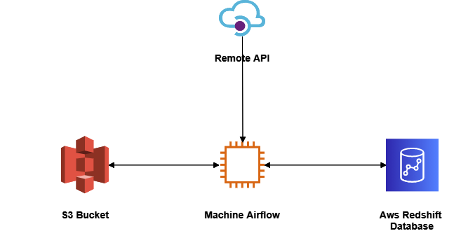
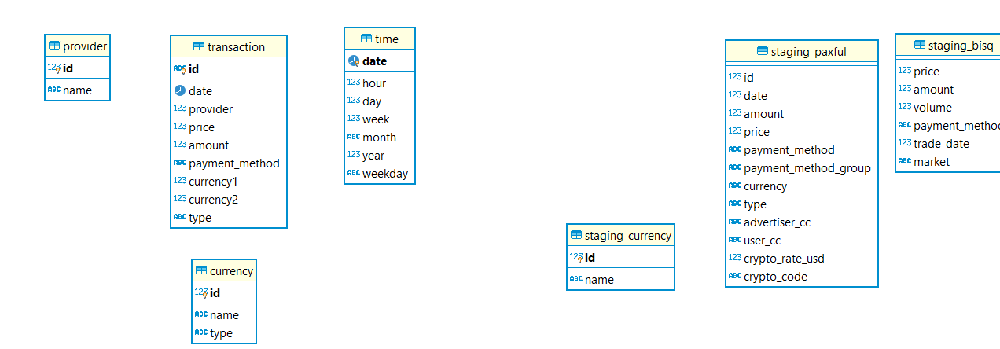

# P2P-Bitcoin-ETL-Pipeline
## Overview Paxful, Bisq ETL pipeline

Data is captured for historical analysis from the APIs of the P2Ps providers using the requests Python library. 
The data collected from the API is stored on the AWS S3 bucket. ETL jobs are written in python and scheduled in airflow to run every day.

    
    

### Paxful 

 Paxful is a P2P platform that has seen significant growth since inception. In 2015, the platform reported 
 $5.9M in USD trade volume which has steadily increased by 25% or more year over year. 
 At the close of 2017, they reported more than $500M in USD trade volume, with 2019 tripling that number closing at 
 more than $1.6B. In addition, they have seen 1 million wallets added in the past year, which is a vast difference 
 from the 97K opened in 2015. Recently, Paxful reported having more than 3 million wallets registered on the platform.
 
### Bisq

Bisq is a P2P platform that is an open-source, peer-to-peer application that allows buy and sell cryptocurrencies in 
exchange for national currencies. In number Bisq is working from 2018 and have 70.000 + trades accomplished until now.  

## Architecture 

Pipeline Consists of various modules:

 - [GoodReads Python Wrapper](https://github.com/san089/goodreads)
 - ETL Jobs
 - Redshift Warehouse Module

### ETL Flow
 - We create the tables required for work
 - Query the API and fetch the information of a specific time  
 - Data Collected from the API is moved to s3 buckets.
 - Warehouse module of ETL jobs picks up data from zone and stages it into the Redshift staging tables.
 - Using the Redshift staging tables and INSERT operation is performed on the Data Warehouse tables to update the dataset.
 - ETL job execution is completed once the Data Warehouse is updated. 
 - Airflow DAG runs the data quality check on all Warehouse tables once the ETL job execution is completed.
 - Dag execution completes after these Data Quality check.

## Data model

### Production Schema

- provider: static database with the diferent providers 
- currency: list of currencies on the tables
- transaction: list of transactions that comes fron the API
- time: dimensional table to store the information of time

### Staging Schema 

- staging_currency: Currency table used to avoid the duplication of currencies in the dimensional table.
- staging_bisq: raw data from the bisq API
- staging_paxful: raw data from the paxful API

## Scenarios

-   Data increase by 100x. read > write. write > read
    
    -   Redshift: Analytical database, optimized for aggregation, also good performance for read-heavy workloads
    -   implement Spark EMR cluster size to handle bigger volume of data

-   Pipelines would be run on 7am daily. how to update dashboard? would it still work?
    
    -   DAG is scheduled to run every day and can be configured to run every morning at 7 AM if required. 
    -   Data quality operators are used at appropriate position. In case of DAG failures email triggers can be configured to let the team know about pipeline failures.
    
-   Make it available to 100+ people
    -   We can set the concurrency limit for your Amazon Redshift cluster. While the concurrency limit is 50 parallel queries for a single period of time, this is on a per cluster basis, meaning you can launch as many clusters as fit for you business.
    
## Documentation of the APIS

- Bisq Documentation https://bisq.markets/api/#trades
- Paxful Trade History https://developers.paxful.com/public-data/trades-history/