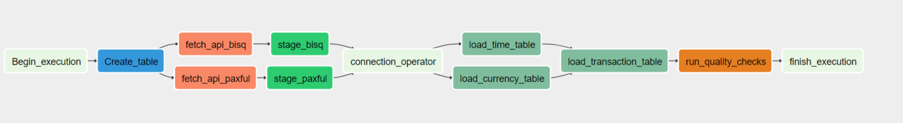

# P2P-Bitcoin-ETL-Pipeline
## Overview Paxful, Bisq ETL pipeline

Data is captured for historical analysis from the APIs of the P2Ps providers using the requests Python library. 
The data collected from the API is stored on the AWS S3 bucket. ETL jobs are written in python and scheduled in airflow to run every day.

<p float="left">
    
    
</p>

### Paxful 

 Paxful is a P2P platform that has seen significant growth since inception. In 2015, the platform reported 
 $5.9M in USD trade volume which has steadily increased by 25% or more year over year. 
 At the close of 2017, they reported more than $500M in USD trade volume, with 2019 tripling that number closing at 
 more than $1.6B. In addition, they have seen 1 million wallets added in the past year, which is a vast difference 
 from the 97K opened in 2015. Recently, Paxful reported having more than 3 million wallets registered on the platform.
 
### Bisq

Bisq is a P2P platform that is an open-source, peer-to-peer application that allows buy and sell cryptocurrencies in 
exchange for national currencies. In number Bisq is working from 2018 and have 70.000 + trades accomplished until now.  


## Architecture 


Pipeline Consists of various modules:

 - [GoodReads Python Wrapper](https://github.com/san089/goodreads)
 - ETL Jobs
 - Redshift Warehouse Module

### ETL Flow
 - We create the tables required for work
 - Query the API and fetch the information of a specific time  
 - Data Collected from the API is moved to s3 buckets.
 - Warehouse module of ETL jobs picks up data from zone and stages it into the Redshift staging tables.
 - Using the Redshift staging tables and INSERT operation is performed on the Data Warehouse tables to update the dataset.
 - ETL job execution is completed once the Data Warehouse is updated. 
 - Airflow DAG runs the data quality check on all Warehouse tables once the ETL job execution is completed.
 - Dag execution completes after these Data Quality check.



## Running the project

### Hardware Used
For installation and run the project you have to use:
- Use a ec2 instance with a minimum 2 cpu and 4gb ram to run the Airflow instance
- For Redshift use minimum a 2 Node cluster with Instance Types dc2.large

### Setting Up Airflow

For a development enviroment you can follow this guide for setup and configure the instance with this 
[Guide](https://medium.com/@abraham.pabbathi/airflow-on-aws-ec2-instance-with-ubuntu-aff8d3206171)

### Setting up Redshift
You can follow the AWS [ Guide](https://docs.aws.amazon.com/redshift/latest/gsg/rs-gsg-launch-sample-cluster.html) 
to run a Redshift cluster.

### Setting up S3
You can follow the AWS [ Guide](https://docs.aws.amazon.com/AmazonS3/latest/user-guide/create-bucket.html) 
to create a bucket.

### How to run 
Make sure Airflow webserver and scheduler is running. 
Open the Airflow UI `http://< ec2-instance-ip >:< configured-port >` 

In admin -> connections please configure the follow:
- aws_con: with the credential to enter with AWS and upload the information
- redshift: with the information for the connection of the Redshift cluster

## Data model

The goal of this project is do analytical queries over the information of the different providers to understand 
how the market works, and be able to get some insights like:

- When the users buy or sell more in the day
- What is the behavior of each day to now what are the days with more movement

With this purpose i choose a star schema where the center of the information is the transaction table, and aditionally 
to this the project have some dimensions tables like provider, currency and time, to help with the organization of the
data and do better analytical query.


### Example queries:

-  Select when the users buy or sell more in the day

```
SELECT avg(amount), time."hour", type FROM "transaction" t join time on time."date" = t.date where currency1 = 5 or currency2 =5 group by "type", "hour" order by avg ;
```

- Select the behavior of each day to now what are the days with more movement

```
SELECT sum(amount), time.weekday FROM "transaction" t join time on time."date" = t.date where currency1 = 5 or currency2 =5 group by "weekday" order by avg desc ;
```


### Production Schema

- transaction: list of transactions that comes from the APIs
    - id: id of the transaction to represent a unique value
    - date: timestamp with the date of the transaction
    - provider: The id that identify the provider of the transaction
    - price: decimal value that store the amount paid for this account of cryptocurrency
    - amount: decimal value that store amount interchanged
    - paymenth_method: this is the name of the payment method that comes from the P2P provider
    - currency1: is the id of the first currency that come from a different table
    - currency2: is the id of the second currency involved on the transaction
    - type: type of transaction, it could be "sell", "buy", or "na"
- provider: static database with the diferent providers 
    - id: the primary key to represent a unique value
    - name: the name of the provider
- currency: list of currencies on the tables
    - id: the primary key to represent a unique value
    - name: the name of the currency
    - type: additional column that should be manual filled to represent if the currency is "flat" or "crypto" 
- time: dimensional table to store the information of time
    - date: timestamp of the current row
    - hour: integer number with the hour
    - day: integer number with the day
    - week: integer number with the week
    - month: integer number with the month
    - year: integer number with the year
    - weekday: integer number with the day of the week

### Staging Schema 

- staging_currency: Currency table used to avoid the duplication of currencies in the dimensional table.
    - id: the primary key to represent a unique value
    - name: the name of the currency that will going to be imported
- staging_bisq: raw data from the bisq API
    - price: price of the coin
    - amount: amount interchanged in this transaction
    - volume: amount of crypto that was interchanged historical
    - payment_method: payment method used for pay for this transaction
    - trade_date: integer with the datetime of the transaction
    - market: market where the transaction was made, example: "btc_usd"
- staging_paxful: raw data from the paxful API
    - id: id that come from the paxful API
    - date: integer with the datetime of the transaction 
    - amount: amount interchanged 
    - price: price paid for but the coin
    - paymenth_method: paymenth method for this transaction
    - paymenth_method_group: paymenth method group
    - currency: indicates the currency of the transaction
    - type: indicates buy or sell trade
    - advertiser_cc: Not specified on the documentation
    - user_cc: Not specified on the documentation
    - crypto_rate_usd: Not specified on the documentation
    - crypto_code: indicate the crypto currency interchanged

## Scenarios

-   Data increase by 100x. read > write. write > read
    
    -   Redshift: Analytical database, optimized for aggregation, also good performance for read-heavy workloads
    -   implement Spark EMR cluster size to handle bigger volume of data

-   Pipelines would be run on 7am daily. how to update dashboard? would it still work?
    
    -   DAG is scheduled to run every day and can be configured to run every morning at 7 AM if required. 
    -   Data quality operators are used at appropriate position. In case of DAG failures email triggers can be configured to let the team know about pipeline failures.
    
-   Make it available to 100+ people
    -   The more people accessing the database the more CPU resources you need to get a fast experience. By using a 
    distributed database you can improve your replications and partitioning to get faster query results for each user.
    
## Documentation of the APIS

- Bisq Documentation https://bisq.markets/api/#trades
- Paxful Trade History https://developers.paxful.com/public-data/trades-history/